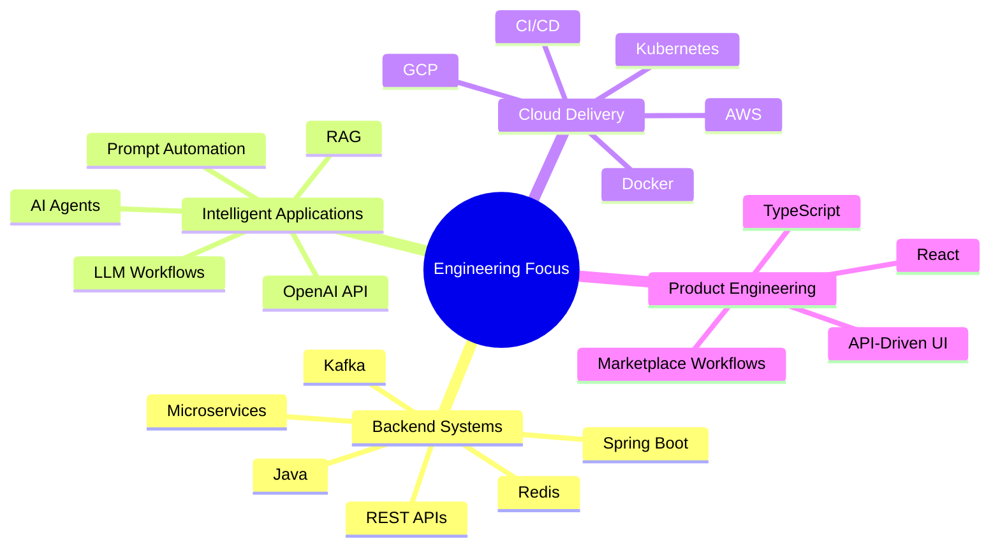

<p align="center">
  
</p>

<p align="center">
  
</p>

<p align="center">
  <a href="https://www.linkedin.com/in/leelamanisankar-peerukattla/">
    
  </a>
  <a href="mailto:leelamanisankarpeerukattla@gmail.com">
    
  </a>
  <a href="https://github.com/leelamanisankarpeerukattla">
    
  </a>
</p>

<p align="center">
  
  
</p>

---

## 👋 About Me

I’m a **Software Engineer** focused on building **backend-heavy full-stack systems**, **intelligent applications**, and **AI-enabled product workflows**.

My engineering work combines **Java, Python, Spring Boot, React, TypeScript, OpenAI API, AI Agents, RAG, LLM workflows, AWS, GCP, Docker, and CI/CD** to design reliable APIs, scalable backend services, cloud-ready applications, and practical AI features for real product use cases.

```txt
Backend Engineering      APIs · Microservices · Spring Boot · Auth · Distributed Systems
AI Product Engineering   OpenAI API · AI Agents · RAG · LLM Workflows · Prompt Automation
Cloud & DevOps           AWS · GCP · Docker · Kubernetes · GitHub Actions · Jenkins
Full-Stack Delivery      React · TypeScript · API-Driven Dashboards · Product Workflows
```

---

## ⚡ Engineering Profile

<table>
<tr>
<td width="50%">

### 🧩 Backend & Platform Systems

I build backend systems with clean service boundaries, REST APIs, authentication flows, role-based access patterns, and database-backed product logic.

**Core areas:** Spring Boot, Java, Python, microservices, PostgreSQL, Redis, Kafka, API integrations, and scalable backend design.

</td>
<td width="50%">

### 🤖 Intelligent Applications & AI

I work on AI-enabled product workflows using LLM APIs, guided interactions, AI-assisted responses, prompt-driven automation, and agent/RAG-style concepts.

**Core areas:** OpenAI API, AI Agents, RAG, LLM workflows, prompt engineering, automation, and AI-assisted customer engagement.

</td>
</tr>
<tr>
<td width="50%">

### ☁️ Cloud, DevOps & Reliability

I focus on building services that are deployment-ready, observable, testable, and easier to operate across development and production-style environments.

**Core areas:** AWS, GCP, Docker, Kubernetes, CI/CD, logging, metrics, debugging, monitoring, and release reliability.

</td>
<td width="50%">

### 🖥️ Full-Stack Product Delivery

I connect backend services with user-facing workflows through React and TypeScript, especially for marketplace, admin, booking, messaging, and dashboard-style features.

**Core areas:** React, TypeScript, API-driven UI, product workflows, validation, and maintainable feature delivery.

</td>
</tr>
</table>

---

## 🚀 Featured Engineering Projects

<table>
<tr>
<td width="50%">

### 🛒 Enterprise Full-Stack Order Management System

A production-style distributed order platform built with **Java 17, Spring Boot microservices, Kafka, PostgreSQL, Redis, JWT/RBAC, Docker, Kubernetes manifests, React, TypeScript, and GitHub Actions CI**.

This project demonstrates how independent backend services can communicate through events while maintaining clear boundaries for order, inventory, payment, authentication, and gateway responsibilities.

**Engineering highlights**
- Designed service-oriented backend architecture with separate domain services
- Implemented event-driven workflows using Kafka for asynchronous communication
- Added JWT/RBAC-based authentication and authorization patterns
- Used PostgreSQL per-service data modeling with Redis caching for faster access paths
- Added Docker Compose, Kubernetes manifests, and GitHub Actions for repeatable delivery

**Why it matters:** shows production-style backend architecture, async workflows, reliability patterns, service boundaries, and cloud-ready deployment thinking.

<br />

<a href="https://github.com/leelamanisankarpeerukattla/enterprise-order-management-system">
  
</a>

</td>
<td width="50%">

### 🛡️ Distributed API Rate Limiter & Protection Service

A high-performance API protection service built with **Java 17, Spring Boot, Redis Lua scripts, Docker, token bucket logic, sliding-window algorithms, metrics, and health endpoints**.

This project focuses on protecting backend APIs from excessive traffic while keeping request decisions fast, consistent, and observable across users, IPs, and endpoints.

**Engineering highlights**
- Implemented token bucket and sliding-window rate-limiting strategies
- Used Redis Lua scripts for atomic request evaluation under concurrency
- Added per-user, per-IP, and per-endpoint quota support
- Returned standard rate-limit headers for client visibility
- Exposed health and metrics endpoints for operational monitoring

**Why it matters:** shows systems thinking, low-latency backend design, concurrency control, API security, fault tolerance, and observable service behavior.

<br />

<a href="https://github.com/leelamanisankarpeerukattla/distributed-api-rate-limiter">
  
</a>

</td>
</tr>
<tr>
<td width="50%">

### 🤖 AI-Enabled SaaS Marketplace Backend

Backend workflows for a marketplace platform involving **provider/customer roles, booking flows, messaging, onboarding, admin review, secure media handling, PostgreSQL/Supabase data models, and OpenAI-assisted interactions**.

This project connects practical backend engineering with AI-enabled product workflows, helping marketplace users complete guided actions while supporting operational flows for admins, providers, subcontractors, and customers.

**Engineering highlights**
- Built role-based marketplace workflows for customers, providers, subcontractors, and admins
- Supported booking, listing availability, onboarding, messaging, incidents, and reviews
- Integrated AI-assisted workflows for guided interactions and automated support experiences
- Worked with PostgreSQL/Supabase-backed data flows and secure media handling
- Created QA coverage, edge-case validation, workflow documentation, and defect prioritization

**Why it matters:** demonstrates real product engineering, marketplace operations, role-based backend logic, AI workflow integration, and customer-facing automation.

<br />


</td>
<td width="50%">

### 💳 JPMorgan Midas Core Simulation

A financial-style backend simulation built with **Spring Boot, Kafka, JPA, H2 database, REST APIs, embedded Kafka tests, and transaction debugging workflows**.

This project models backend event processing and transaction handling patterns commonly found in financial and enterprise systems.

**Engineering highlights**
- Built Kafka-based transaction listener and processing flow
- Persisted transaction data using Spring Data JPA and H2
- Created REST endpoint for balance retrieval and validation
- Used embedded Kafka tests for integration-style verification
- Debugged transaction and data-flow behavior across service boundaries

**Why it matters:** demonstrates event processing, backend integration, testing, persistence, debugging, and financial-style workflow implementation.

<br />

<a href="https://github.com/leelamanisankarpeerukattla/forage-midas">
  
</a>

</td>
</tr>
</table>

---

## 🛠️ Core Tech Stack

<p align="center">
  
</p>

<p align="center">
  
  
  
  
  
</p>

---

## 🎯 Current Focus



---

## 📊 GitHub Snapshot

<p align="center">
  
  
</p>

<p align="center">
  
</p>

<p align="center">
  
</p>

---

## 🤝 Open To

<p align="center">
  
  
  
</p>

<p align="center">
  <b>Software Engineer · Backend Engineer · Full-Stack Engineer · Platform Engineer · AI Product Engineering</b>
</p>

<p align="center">
  <i>Building reliable backend systems, intelligent applications, cloud-ready APIs, and AI-powered product workflows.</i>
</p>

<p align="center">
  
</p>
